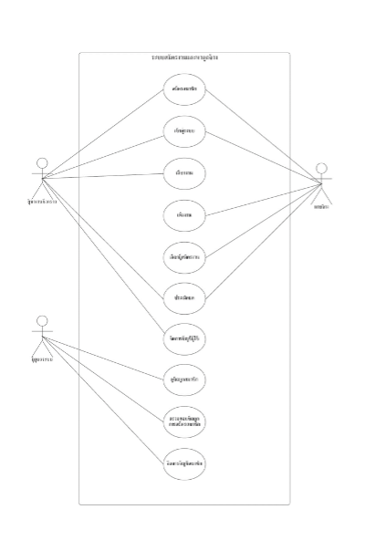
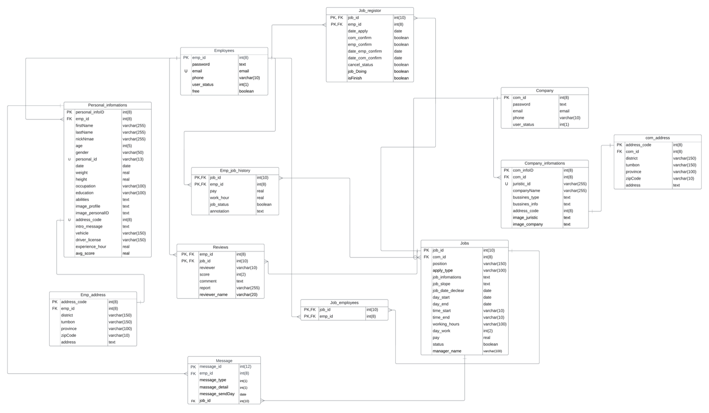

# โครงงานวิชา 06016323 Mobile Device Programming
### โครงงานนี้เป็นส่วนหนึ่งของวิชา การโปรแกรมอุปกรณ์เคลื่อนที่ ของนักศึกษาชั้นปีที่ 3 ภาคเรียนที่ 1/2566
### คณะเทคโนโลยีสารสนเทศ สาขาเทคโนโลยีสารสนเทศ แขนง วิศวกรรมซอฟต์แวร์ 
### สถาบันเทคโนโลยีพระจอมเกล้าเจ้าคุณทหารลาดกระบัง
___
## ผู้จัดทำโครงงาน
1. นายวิชัย คำมงคุณ
2. นายอนพัทย์ นันทนพิบูล


### ชื่อโครงงาน TT-Jobs
> โครงงานนี้เราให้ความสำคัญในการพัฒนาแอปพลิเคชันสำหรับให้ผู้ที่ต้องการหางานพิเศษชั่วคราวและกลุ่มผู้จ้างงานที่ต้องการคนทำงานได้มีช่องทางในการคัดเลือกและค้นหางานชั่วคราวและลูกจ้างชั่วคราวที่เหมาะสม โดยในสังคมปัจจุบันการหารายได้เสริมโดยการรับจ้างทำงานพิเศษก็เป็นที่นิยมมากในกลุ่มนักเรียน นักศึกษา ที่ต้องการลดภาระผู้ปกครอง และรวมถึงคนทั่วไปที่ต้องการรายได้เสริม โดยที่ภาคธุรกิจเองก็มีความต้องการและเปิดโอกาสให้คนกลุ่มนี้ได้เข้ามาทำงานมากขึ้น โดยเฉพราะธุรกิจอาหารและบริการซึ่งเป็นธุรกิจที่ต้องการพนักงานผู้ให้บริการ จำนวนมาก ดังนั้นผู้จัดทำโครงงานจึงมีแนวคิดในการพัฒนาแอปพลิเคชันหางานและลูกจ้างชั่วคราว เพื่อจะช่วยส่งเสริมการหางานและลูกจ้างได้มีประสิทธิภาพมากขึ้นเพราะช่องทางการค้นหางานและลูกจ้างทำได้ง่ายและสดวกมากขึ้นและนำข้อมูลที่ได้จากการใช้งานของผู้ใช้แอพลิเคชันของเรามาวิเคราะห์และนำไปใช้ประโยชน์ในด้านการส่งเสริมการจ้างงานต่อไป
___
### เทคโนโลยีที่ใช้
- React Native (JS)
- Vue JS
- Express JS
- Flask Framework (Python)
- Mysql (database)
- Firebase

### วิธีติดตั้ง และใช้งานโปรแกรม

1. ติดตั้ง python และ package ที่เกี่ยวข้อง
2. สร้าง database โดยใช้คำสั่งใน Database/createTable-ttjobDB.sql run บนโปรแกรม Mysql workbench [MySQL Workbench Tutorial](https://www.youtube.com/watch?v=fUK94jOFwBc)
3. แก้ไขโค้ดในไฟล์ Mobile/ServerMobile/service/connect_database/Database.py <br/>
```
host = "Your host";
user = "Your username";
password = "Your password";
database_name = "Your database";
```
4. แก้ไขโค้ดในไฟล์ Mobile/ServerMobile/service/public_service.py ให้ใส่ Google API KEY ของคุณ
```
api_key = "Your google API key"; # copy your api key => Paste to value at api_key
```
5.  แก้ไขโค้ดในไฟล์ Mobile/ServerMobile/service/services/EmployeeService.py โดยให้เพิ่มข้อมูล firebase config [Firebase Storag Tutorial](https://www.youtube.com/watch?v=f388UfOoF4g) <br/>แก้ไขตัวแปล user เพื่อ sign in รับ url ของรูปภาพ [Get URL of Image in Firebase Storage](https://www.youtube.com/watch?v=53qOv3nuo4c&t=100s)
```
firebaseConfig = {
    'apiKey': "",
    'authDomain': "",
    'projectId': "",
    'storageBucket': "",
    'messagingSenderId': "",
    'appId': "",
    'measurementId': "",
    'serviceAccount': 'service/serviceAccount.json',
    'databaseURL': ""
}

firebase = pyrebase.initialize_app(firebaseConfig)
storage = firebase.storage()
auth = firebase.auth()
user = auth.sign_in_with_email_and_password('your email', 'your password');
```
6.  และแก้ไขโค้ดในไฟล์ Mobile/ServerMobile/service/serviceAccount.json
```
{
    "type": "service_account",
    "project_id": "",
    "private_key_id": "",
    "private_key": "",
    "client_email": "",
    "client_id": "",
    "auth_uri": "",
    "token_uri": "",
    "auth_provider_x509_cert_url": "",
    "client_x509_cert_url": "",
    "universe_domain": "googleapis.com"
}
```
7.  แก้ไขโค้ในไฟล์ WebApp/Back-End/register/regis.js
```
const firebase = admin.initializeApp({
    credential: admin.credential.cert(serviceAccount),
    storageBucket: "" // url starageBucket
  });
```
8.  แก้ไขโค้ดในไฟล์ WebApp/Back-End/register/mobile-image-com-firebase-adminsdk-1c6sa-d34470338f.json
```
{
  "type": "service_account",
  "project_id": "",
  "private_key_id": "",
  "private_key": "",
  "client_email": "",
  "client_id": "",
  "auth_uri": "https://accounts.google.com/o/oauth2/auth",
  "token_uri": "https://oauth2.googleapis.com/token",
  "auth_provider_x509_cert_url": "https://www.googleapis.com/oauth2/v1/certs",
  "client_x509_cert_url": "",
  "universe_domain": "googleapis.com"
}
```

9. เปิด Terminal หรือ cmd และเข้าไปที่ไฟล์ Mobile/Screen Mobile
10. พิมพ์คำสั่ง ```npm install หรือ npm i``` เพื่อติดตั้ง nodemodule ของ Reac-Native และPackage อื่นๆ
11. เปิด Terminal หรือ cmd และเข้าไปที่ไฟล์ WebApp/Back-End
12. พิมพ์คำสั่ง ```npm install หรือ npm i``` เพื่อติดตั้ง nodemodule ต่างๆ
13. เปิดใช้งาน Back-END ของ WEB ด้วยคำสั่ง ``` npm run serve ```
14. เปิดใช้งาน Back-END ของ Mobile ด้วยคำสั่ง ``` flask --app app.py run –debug ```
15. เปิดใช้งาน Font-END ของ Mobile ด้วยคำสั่ง ``` npm run start ```
## USECASE DIAGRAM

___

## Entity Relationship(ER) Diagram



